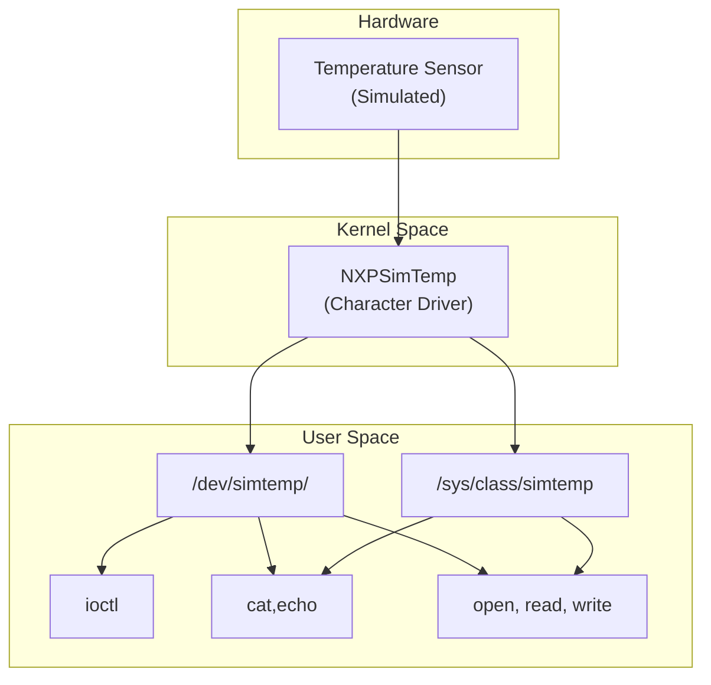
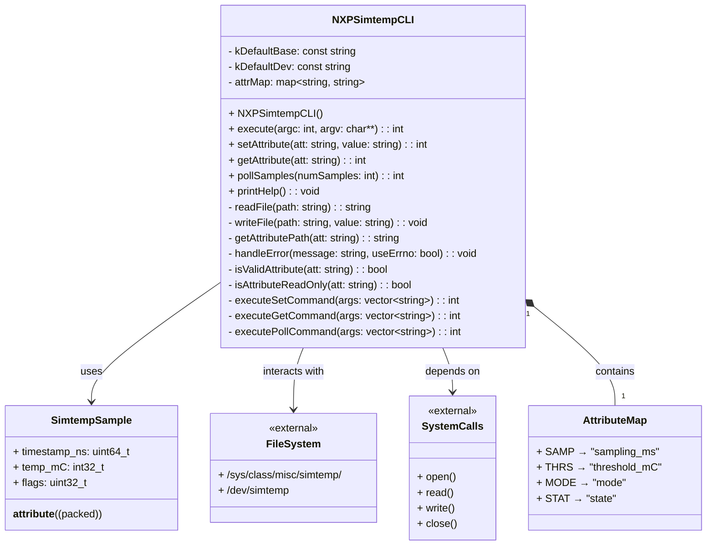
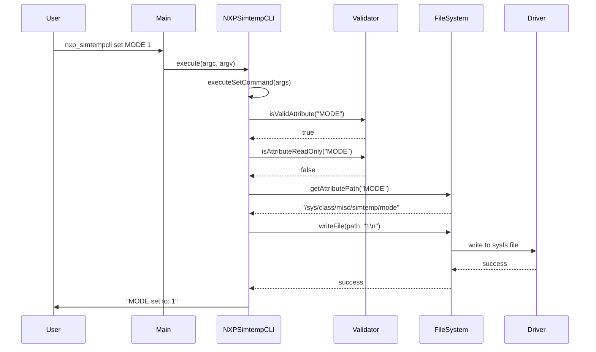
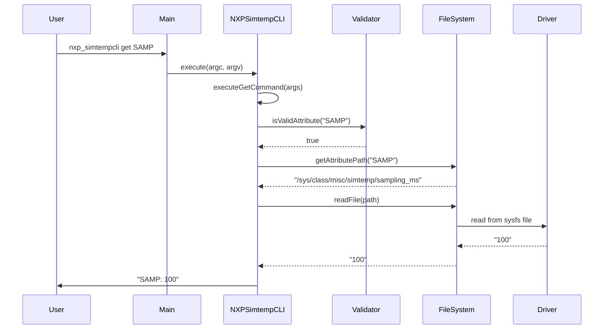

# Simulated Temperature Sensor Driver

## Author
- **Name:** Jose Jorge Figueroa  
- **Role:** Embedded Systems Engineer  
- **Contact:** [GitHub](https://github.com/Figuejojo)  
---
# Design
This project builds a small system that simulates a hardware sensor in the Linux kernel and exposes it to user space, with a user-space application to configure and read it.  
A lightweight GUI is **optional**.

## Why This Matters
In many embedded or Linux-based projects, real hardware sensors may not always be available during early development or testing.  
By simulating a sensor inside the kernel, we can:  
- **Develop and test drivers** without relying on physical hardware.  
- **Validate user-space applications** that consume sensor data.  
- **Enable CI/automation** environments where hardware cannot be easily deployed.  
- **Experiment with kernel-user interfaces** (character devices, sysfs, ioctl, polling).  
This makes the project valuable for learning, prototyping, and validating system designs before integrating actual hardware.

## Goals & Approach
### Primary Objectives
- **Incremental development** with time constraints — Agile, results-driven delivery
- **Stable baseline** before implementing optional features
- **Code quality** ensured through early integration of linting tools
- **Comprehensive testing** at all levels of the stack

### Development Methodology
- **Test-Driven Development (TDD)** where practical
- **Continuous Integration** with automated testing
- **Documentation-driven development** to maintain clarity

### Quality Assurance
- **lint.sh** integrated early to ensure code quality from the start
- **Static analysis** for both kernel and userspace code

## System Architecture

### Kernel ↔ User Space Interface (Overview)
The diagram below shows how the simulated hardware (a temperature sensor) is integrated through the driver and exposed to user space.


### Kernel Space
The driver is responsible for simulating the temperature sensor behavior (e.g., Gaussian noise, ramp, normal) and handling requests from user space.
#### Simmulation Engine
- **Normal Mode**:  Stable temperature readings with minimal variation.
- **Nisy Mode**: Gaussian noise applied to simulate real sensor behavior.
- **Ramp Mode**: Linear temperature changes for testing threshold detection.
#### Configuration Management
- Parameter validation for all user-configurable settings
- Mutex and Atomic updates to prevent race conditions

#### Event System
- Threshold detection and status reporting.
- Poll support for efficient event waiting.

### User Space 
The user space provides the interface for applications or users to issue requests and configure driver settings.

#### Character Device /dev/x
Represents the device node, which acts as the main data path for operations.
Supported operations include:
- open(): Initializes communication with the device.
- read(): Retrieves the latest simulated sensor value.
- write(): Sends commands or data to the device (if supported).
- poll(), epoll(): Enables event-driven data access.
- icotl() (Optional): Provides extended control operations.
- close(): Cleans up device resources.

#### /sys/class/x
The ```/sys/``` directory exposes configuration parameters through a simple file-based interface.
Available parameters in this module:
- sampletime_ms (RW): Update period
- threshold-mC  (RW): Alert Threshold in m°C
- mode          (RW): enum(Normal|Noisy|Ramp)
- stats         (RO): Counter.

## CLI Design
The CLI application follows a layered architecture.

### UML Architecture Design

### Enhanced Sequence Diagrams

#### Set Command Squence Command (AI Generated)



#### Get Command Squence Command (AI Generated)


## Application (Optional)
A user-space application to:
- Read sensor values directly
- Modify configuration parameters
- (Optionally) GUI for visualization and control

## Future Enhancements Section
- Design and Develop a GUI for the Driver
- Modify Qemu so it is able to run custom dtb's.
- Support multiple driver simulations.
    - Move from single instance to multi-instance.
- Add Unit testing.
