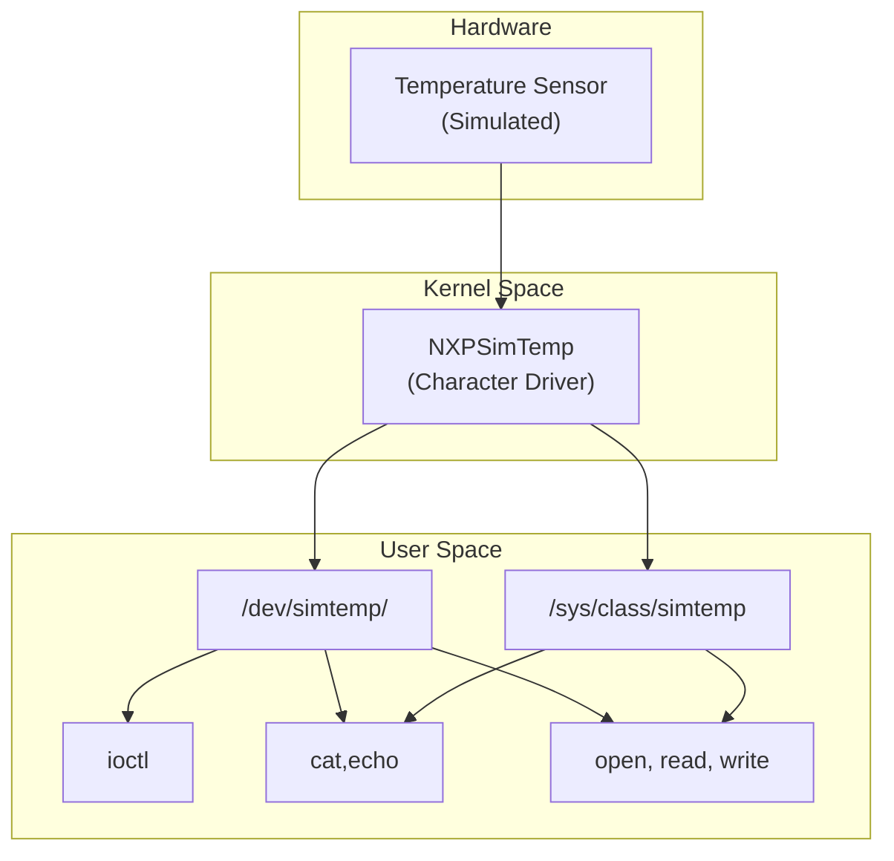

# Simulated Temperature Sensor Driver

## Author
- **Name:** Jose Jorge Figueroa  
- **Role:** Embedded Systems Engineer  
- **Contact:** [GitHub](https://github.com/Figuejojo)  
---
# Design
This project builds a small system that simulates a hardware sensor in the Linux kernel and exposes it to user space, with a user-space application to configure and read it.  
A lightweight GUI is **optional**.

## Why This Matters
In many embedded or Linux-based projects, real hardware sensors may not always be available during early development or testing.  
By simulating a sensor inside the kernel, we can:  
- **Develop and test drivers** without relying on physical hardware.  
- **Validate user-space applications** that consume sensor data.  
- **Enable CI/automation** environments where hardware cannot be easily deployed.  
- **Experiment with kernel-user interfaces** (character devices, sysfs, ioctl, polling).  
This makes the project valuable for learning, prototyping, and validating system designs before integrating actual hardware.

## Goals & Approach
- **Incremental development** with time constraints — Agile, results-driven delivery.  
- **Optional features** will be addressed only after a strong and stable baseline has been reached.  
- **lint.sh** was added early ensuring good code quality form the start.

## Kernel ↔ User Space Diagram
The diagram below shows how the simulated hardware (a temperature sensor) is integrated through the driver and exposed to user space.


### Kernel Space
The driver is responsible for simulating the temperature sensor behavior (e.g., Gaussian noise, ramp, normal) and handling requests from user space.
### User Space 
The user space provides the interface for applications or users to issue requests and configure driver settings.
#### /dev/x
Represents the device node, which acts as the main data path for operations.
Supported operations include:
- open(): Opens the device file and prepares it for 
communication.
- read(): Reads the latest simulated sensor value (e.g., temperature).
- poll(), epoll(): Allows user processes to wait for new data (event-driven access). Useful for applications that should wake only when new samples are ready.
- icotl() (Optional): Provides an extended control interface, typically used to send/receive structured commands beyond simple reads/writes
#### /sys/class/x
The ```/sys/``` directory exposes configuration parameters through a simple file-based interface.
Available parameters in this module:
- sampletime_ms (RW): Update period
- threshold-mC  (RW): Alert Threshold in m°C
- mode          (RW): enum(Normal|Noisy|Ramp)
- stats         (RO): Counter.

## Application (Optional)
A user-space application to:
- Read sensor values directly
- Modify configuration parameters
- (Optionally) GUI for visualization and control